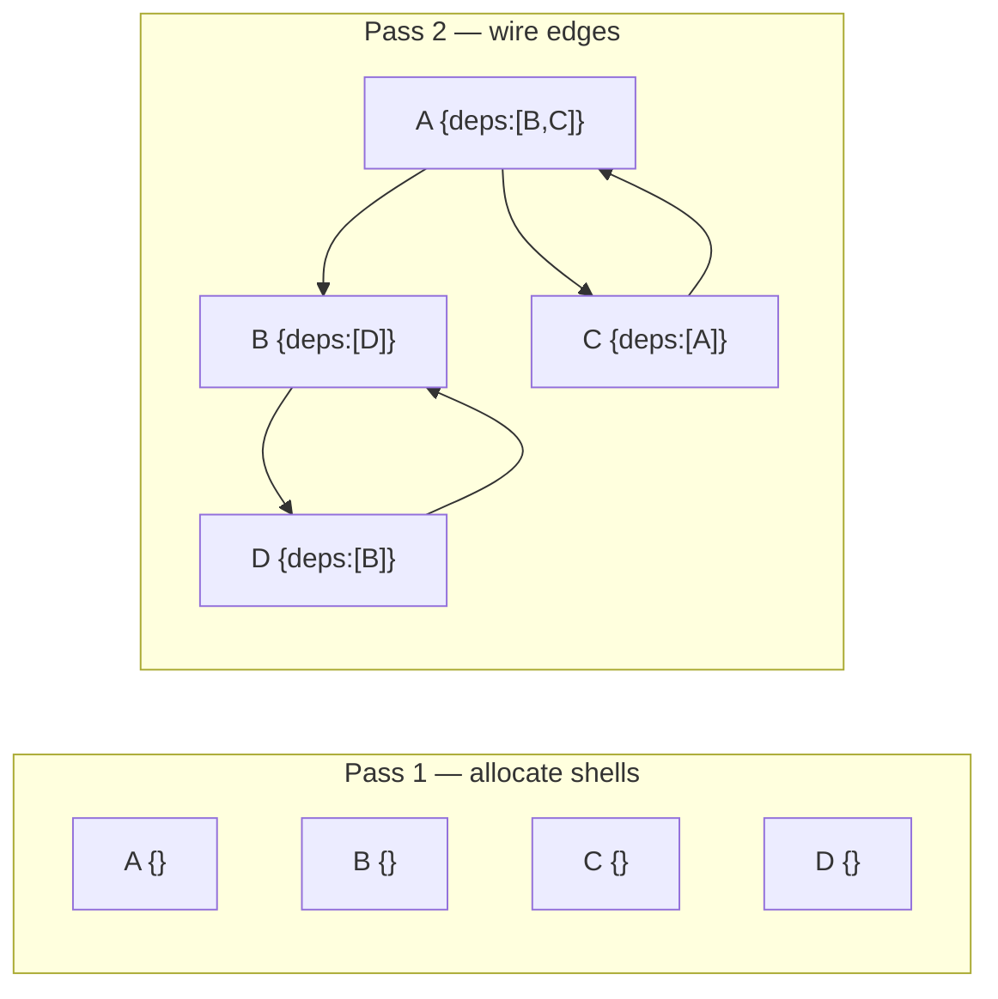

# Populating Cyclic Graphs in O(V+E): Solving the Recursive Population Problem

## §1 — The Problem

`populateAll()` — replacing foreign-key IDs with fully resolved objects — is a foundational
operation in every data framework. On trees and DAGs it is trivial: recurse into each
dependency and return the resolved node. The catch is that real-world schemas are rarely
acyclic. Component systems, org charts, and permission models all have bidirectional references.
On these graphs, naive recursion does not terminate.

The failure is not graceful. When the traversal revisits a node it has already started
processing, the call stack grows without bound until V8 raises `RangeError: Maximum call stack
size exceeded` — no partial result, no descriptive error, just a runtime crash. The only
fix developers have historically reached for is a `maxDepth` guard that silently truncates the
result, producing a subtly wrong object graph.

A two-pass allocate-then-wire strategy solves this in O(V+E) time with zero recursion: allocate
every node shell first (Pass 1), then fill in the edges via Map lookup (Pass 2). Cycles resolve
naturally because every object already exists before any edge is wired.

---

## §2 — A Recognized Challenge in the Data Layer Ecosystem

This research was motivated by [Mongoose issue #16074](https://github.com/Automattic/mongoose/issues/16074),
which describes a `populate()` call on a self-referential model crashing with a stack overflow.
It is a concrete, open example of the problem this experiment addresses.

Looking at the broader ORM/ODM landscape, the same pattern of cyclic reference challenges
appears consistently across other data libraries — visible in their open issue trackers and
documentation:

| Library | Issue / Discussion | Documentation | Failure Mode |
|---|---|---|---|
| **Mongoose** | [#16074](https://github.com/Automattic/mongoose/issues/16074) — schema-driven `populateAll()` with `maxDepth`; cites circular refs as motivation | [Population docs](https://mongoosejs.com/docs/populate.html) — no built-in recursive populate | No automatic cycle handling; manual depth management required |
| **Sequelize** | [#1329](https://github.com/sequelize/sequelize/issues/1329) — eager loading with circular associations → `RangeError: Maximum call stack size exceeded` | [Eager Loading](https://sequelize.org/docs/v6/advanced-association-concepts/eager-loading/), [Constraints & Circularities](https://sequelize.org/docs/v6/other-topics/constraints-and-circularities/) | Stack overflow on circular includes |
| **TypeORM** | [#3663](https://github.com/typeorm/typeorm/issues/3663) — `eager: true` on recursive relation causes infinite loop | [Eager/Lazy Relations](https://typeorm.io/eager-and-lazy-relations), [Relations FAQ](https://typeorm.io/relations-faq) | Infinite loop; must not use `eager:true` on both sides |
| **Prisma** | [#3725](https://github.com/prisma/prisma/issues/3725) — feature request: support recursive relationships in queries | [Self-relations docs](https://www.prisma.io/docs/orm/prisma-schema/relations/self-relations) — must manually specify each include depth | Not supported; open feature request since 2020 |
| **MikroORM** | [#4196](https://github.com/mikro-orm/mikro-orm/discussions/4196) — circular populate causes serialization blowup | [Serializing docs](https://mikro-orm.io/docs/serializing#explicit-serialization) — must use explicit serialization to avoid cycles | Overfetch; partial mitigation via serialize hints |

These are ORM/ODM libraries operating at the data layer — the abstraction level where population
and eager-loading live. Larger frameworks like Node.js core, Angular, and React operate at
different levels of abstraction and may handle related graph problems internally in ways we have
not investigated here. This experiment focuses specifically on the ORM/ODM population problem,
where the challenge is well-documented and no general iterative solution is widely available.

---

## §3 — The Four Algorithms

### Naive Recursion — the control

Recurse into each dependency. No cycle guard. On any cyclic graph — even a trivial 10-node
one — the traversal immediately re-enters a visited node and the call stack overflows.

### Map Tracker — correctness fix, not a scalability fix

Add a `visited` Map: if a node is already in the Map, return the cached result instead of
recursing. This eliminates infinite recursion but does not limit call stack depth. On a
50K-node graph, a single DFS path through unvisited nodes can push tens of thousands of frames
before any cycle is hit. The V8 stack limit is ~10K frames — the algorithm still crashes.

### Tarjan SCC Layering — iterative and correct

Run iterative Tarjan's algorithm to find strongly connected components, condense the graph into
a DAG, then process layers with Kahn's BFS in topological order. Fully iterative — no
recursion, no stack risk. Correct at every scale, but carries significant auxiliary overhead:
index/lowlink maps, SCC membership sets, and a condensation adjacency structure.

### Two-Pass Wire — the winner

**Pass 1** — allocate every node shell into a Map:

```typescript
for (const comp of flatDatabaseState) {
  visited.set(comp.id, { id: comp.id, dependencies: [] });
}
```

**Pass 2** — wire dependency edges via Map lookup:

```typescript
for (const comp of flatDatabaseState) {
  const node = visited.get(comp.id)!;
  for (const depId of comp.dependencies) {
    node.dependencies.push(visited.get(depId)!);
  }
}
```

Cycles resolve automatically: if A depends on B and B depends on A, both JS objects already
exist in the Map, so each side's `.push()` captures a reference to the same object — no cycle
detection required. This is structurally identical to forward-declaration in compiled languages.



---

## §4 — Results

Benchmark #1 — CI run (ubuntu-latest, Node 22, 4 GB heap). 250K graph: 250,000 nodes,
500,181 edges. All passing results double-verified (smartCompare + flatCompare).

### Survivability — which algorithms make it?

The primary result is which algorithms survive at each tier. Two of four crash at production
scale.

| Algorithm | basic (10) | medium (5K) | stress (50K) | extreme (250K) |
|---|---|---|---|---|
| Naive Recursion | ❌ Stack overflow | ❌ Stack overflow | ❌ Stack overflow | ❌ Stack overflow |
| Map Tracker | ✅ Pass | ✅ Pass | ❌ Stack overflow | ❌ Stack overflow |
| Tarjan SCC | ✅ Pass | ✅ Pass | ✅ Pass | ✅ Pass |
| Two-Pass Wire | ✅ Pass | ✅ Pass | ✅ Pass | ✅ Pass |

Map Tracker is especially deceptive: it passes at small scale (10–5K nodes), giving false
confidence, then crashes at production scale (50K+). The call stack depth, not the cycle guard,
is the binding constraint.

### O(V+E) complexity proof via operation counts

The `smartCompare` test instruments each run with `nodesProcessed` and `edgesTraversed` counts.
These provide a mathematical proof of linear complexity — unaffected by CI hardware noise:

| Tier | Nodes | Edges | Total ops | Scale ratio |
|---|---|---|---|---|
| stress (50K) | 50,000 | 99,981 | **149,981** | — |
| extreme (250K) | 250,000 | 500,181 | **750,181** | 750,181 / 149,981 ≈ **5.00×** |

The node count scales exactly 5× and the operation count scales 5.00×. This confirms O(V+E):
the algorithm does work strictly proportional to the graph size regardless of structure.

### Time and memory (supporting evidence)

| Algorithm | basic (10) | medium (5K) | stress (50K) | extreme (250K) |
|---|---|---|---|---|
| Map Tracker | 0.3 ms / 0.0 MB | 13 ms / 3.0 MB | ❌ | ❌ |
| Tarjan SCC | 0.8 ms / 0.1 MB | 46 ms / 9.2 MB | 277 ms / 14.8 MB | 2,360 ms / 149 MB |
| Two-Pass Wire | 0.2 ms / 0.0 MB | 13 ms / 2.9 MB | 67 ms / 7.4 MB | 502 ms / 54 MB |

> Times are wall-clock (ms); RAM is heap-delta (MB). Naive Recursion omitted — fails all tiers.

Both passing algorithms are fast enough for production use. The headline insight is not that
Two-Pass Wire is 4.7× faster than Tarjan SCC — it is that the two algorithms developers
reach for first (Naive Recursion and Map Tracker) are fundamentally broken at scale.

---

## §5 — Scaling Analysis

Both algorithms are O(V+E). The super-linear constant at 250K is V8 GC pressure on 54–149 MB
of live heap, not algorithmic complexity.

| Metric | Two-Pass Wire | Tarjan SCC |
|---|---|---|
| 50K → 250K time ratio | 7.5× (for 5× nodes) | 8.5× |
| 50K → 250K RAM ratio | 7.3× | 10.1× |
| Head-to-head at 250K | **502 ms / 54 MB** | 2,360 ms / 149 MB |
| Speed advantage | **4.7× faster** | — |
| RAM advantage | **2.8× less** | — |

Tarjan's auxiliary structures (per-node index/lowlink, SCC sets, condensation DAG) add a
constant overhead per node that compounds with GC at 149 MB of live heap. Two-Pass Wire
allocates exactly V+1 objects (the Map plus one shell per node) and nothing else.

---

## §6 — Applicability to JS Frameworks

Two-Pass Wire needs only a flat `{id, dependencies[]}` list and a Map — it is entirely
framework-agnostic. The `ComponentFlat` → `ComponentPopulated` interface used in this
experiment is a direct analogy to Mongoose's `Document` → `PopulatedDocument` pattern.

**Mongoose** could expose a `cycleStrategy: 'iterative'` option on `populate()`. When set,
the resolver would run a pre-pass to collect all referenced IDs, bulk-fetch them, and wire
via Map lookup — the same two passes, just split across a network boundary.

**Sequelize / TypeORM** follow the same pattern. Eager-loading association resolution is
structurally identical: collect all foreign keys from the parent query result (Pass 1), issue
a single `WHERE id IN (...)` query for each association (the network analog of allocation),
then wire (Pass 2).

**GraphQL** already applies the same philosophy via DataLoader: batch-collect IDs first,
resolve in bulk, return results. Two-Pass Wire is the in-process equivalent — the insight
is identical.

The implementation barrier is low. Any library that can expose the flat ID list before
resolving can adopt this pattern without a major architectural change.

