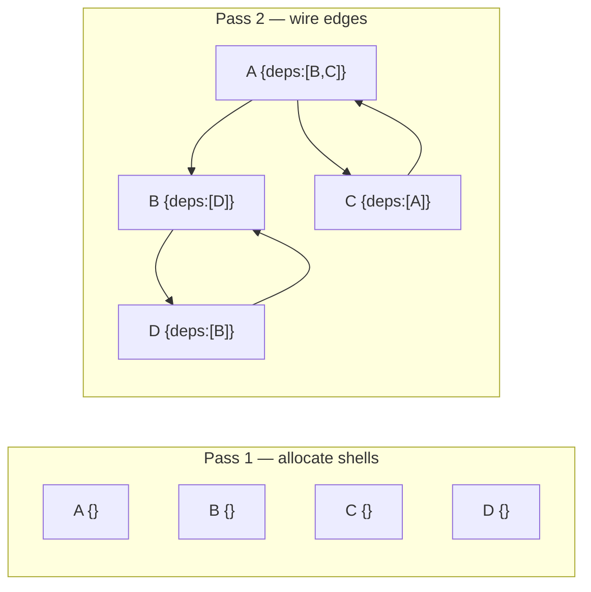

# Cycle-Safe Graph Population in O(V+E): A Two-Pass Solution

## §1 — The Problem

`populateAll()` — replacing foreign-key IDs with fully resolved, nested object graphs — is the
step between a flat database row and the structured data your application expects to work with.
On trees and Directed Acyclic Graphs (DAGs) it is trivial: recurse into each dependency and
return the resolved node. The catch is that real-world schemas are rarely acyclic. Component
systems, org charts, and permission models all have bidirectional references. On these graphs,
naive recursion does not terminate.

The failure is not graceful. When the traversal revisits a node it has already started
processing, the call stack grows without bound until the runtime raises a stack overflow error —
no partial result, no descriptive error, just a crash. A common workaround seen in issue
trackers is a `maxDepth` guard, but this only shifts the problem: the traversal terminates, but
the result is silently truncated, possibly producing an incomplete object graph.

A two-pass allocate-then-wire strategy solves this in O(V+E) time with zero recursion: allocate
every node shell first (Pass 1), then fill in the edges via Map lookup (Pass 2). Cycles resolve
naturally because every object already exists before any edge is wired.

---

## §2 — A Recognized Challenge in the Data Layer Ecosystem

This research was motivated by [Mongoose issue #16074](https://github.com/Automattic/mongoose/issues/16074),
which describes a `populate()` call on a self-referential model crashing with a stack overflow.
It is a concrete, open example of the problem this experiment addresses.

Looking at the broader ORM/ODM landscape, the same pattern of cyclic reference challenges
appears consistently across other data libraries — visible in their open issue trackers and
documentation:

| Library | Issue / Discussion | Documentation | Failure Mode |
|---|---|---|---|
| **Mongoose** | [#16074](https://github.com/Automattic/mongoose/issues/16074) — schema-driven `populateAll()` with `maxDepth`; cites circular refs as motivation | [Population docs](https://mongoosejs.com/docs/populate.html) — no built-in recursive populate | No automatic cycle handling; manual depth management required |
| **Sequelize** | — | [Eager Loading — Including Everything](https://sequelize.org/docs/v6/advanced-association-concepts/eager-loading/#including-everything), [Constraints & Circularities](https://sequelize.org/docs/v6/other-topics/constraints-and-circularities/) | `{ include: { all: true, nested: true } }` does not support circular schemas; must manually break circular includes |
| **TypeORM** | [#3663](https://github.com/typeorm/typeorm/issues/3663) — `eager: true` on recursive relation causes infinite loop | [Eager/Lazy Relations](https://typeorm.io/eager-and-lazy-relations), [Relations FAQ](https://typeorm.io/relations-faq) | Bidirectional recursive eager loading causes infinite recursion; circular eager relations are unsupported |
| **Prisma** | [#3725](https://github.com/prisma/prisma/issues/3725) — feature request: support recursive relationships in queries | [Self-relations](https://www.prisma.io/docs/orm/prisma-schema/data-model/relations/self-relations) — no built-in recursive include; each nesting level must be explicitly written out | No automatic full-depth include; each depth level requires explicit nesting |
| **MikroORM** | — | [Populating relations](https://mikro-orm.io/docs/populating-relations) — `populate: ['*']` on circular entities produces an unserialisable cyclic graph; explicit populate hints required | No safe "populate all" for cyclic schemas; circular populate requires explicit hints to avoid graph explosion |

These are ORM/ODM libraries operating at the data layer — the abstraction level where population
and eager-loading live. Larger frameworks like Node.js core, Angular, and React operate at
different levels of abstraction and may handle related graph problems internally in ways we have
not investigated here. This experiment focuses specifically on the ORM/ODM population problem,
where the challenge is well-documented and no general iterative solution is widely available.

---

## §3 — The Four Algorithms

### Naive Recursion — the control

Recurse into each dependency. No cycle guard. On any cyclic graph — even a trivial 10-node
one — the traversal immediately re-enters a visited node and the call stack overflows.

### Map Tracker — correctness fix, not a scalability fix

Add a `visited` Map: if a node is already in the Map, return the cached result instead of
recursing. This eliminates infinite recursion but does not limit call stack depth. On a
50K-node graph, a single DFS path through unvisited nodes can push tens of thousands of frames
before any cycle is hit. The V8 stack limit is ~10K frames — the algorithm still crashes.

### Tarjan SCC Layering — iterative and correct

First, find every group of nodes that are mutually reachable from each other — these groups
are called Strongly Connected Components (SCCs). For example, if A → B → A, those two nodes
form one SCC. Next, collapse each SCC into a single "super-node" so the graph becomes a DAG
with no cycles. Finally, process that simplified DAG in layer order (topological sort), wiring
all dependencies at each layer before moving to the next. Every step uses an explicit stack or
queue — no recursion at all. Correct at any scale, but requires several auxiliary data
structures to track group membership and the collapsed graph.

### Two-Pass Wire — the winner

**Pass 1** — allocate every node shell into a Map:

```typescript
for (const comp of flatDatabaseState) {
  visited.set(comp.id, { id: comp.id, dependencies: [] });
}
```

**Pass 2** — wire dependency edges via Map lookup:

```typescript
for (const comp of flatDatabaseState) {
  const node = visited.get(comp.id)!;
  for (const depId of comp.dependencies) {
    node.dependencies.push(visited.get(depId)!);
  }
}
```

Cycles resolve automatically: if A depends on B and B depends on A, both JS objects already
exist in the Map, so each side's `.push()` captures a reference to the same object — no cycle
detection required. This is structurally identical to forward-declaration in compiled languages.



---

## §4 — Results

Benchmark #1 — CI run (ubuntu-latest, Node 22, 4 GB heap). 250K graph: 250,000 nodes,
500,181 edges. All passing results double-verified (smartCompare + flatCompare).

### Scale Survivability — which algorithms make it to production?

The primary result is which algorithms survive at each tier. Two of four crash at production
scale.

| Algorithm | basic (10) | medium (5K) | stress (50K) | extreme (250K) |
|---|---|---|---|---|
| Naive Recursion | ❌ Stack overflow | ❌ Stack overflow | ❌ Stack overflow | ❌ Stack overflow |
| Map Tracker | ✅ Pass | ✅ Pass | ❌ Stack overflow | ❌ Stack overflow |
| Tarjan SCC | ✅ Pass | ✅ Pass | ✅ Pass | ✅ Pass |
| Two-Pass Wire | ✅ Pass | ✅ Pass | ✅ Pass | ✅ Pass |

Map Tracker is especially deceptive: it passes at small scale (10–5K nodes), giving false
confidence, then crashes at production scale (50K+). The call stack depth, not the cycle guard,
is the binding constraint.

### O(V+E) complexity: analytical proof

Both passing algorithms are O(V+E) by construction — this can be verified directly in the source code:

**Two-Pass Wire** (`src/algorithms/schema-driven/01-two-pass-wire.ts`):
- Pass 1: one loop over all V nodes to allocate shells → O(V)
- Pass 2: one loop over all V nodes, and for each node iterates over its outgoing edges — each of the E edges is visited exactly once → O(V+E)
- Total: **O(V+E)**

**Tarjan SCC Layering** (`src/algorithms/topological/01-tarjan-scc-layering.ts`):
- Iterative Tarjan's SCC: each node and edge visited exactly once → O(V+E)
- Condensation DAG construction: one pass over all V nodes and E edges → O(V+E)
- Kahn's BFS layer assignment: one pass over condensed nodes and edges → O(V+E)
- Pre-allocation and wiring: O(V) + O(V+E)
- Total: **O(V+E)**

### Graph-scale confirmation

This subsection answers two questions: did the graph generator actually produce the expected
graph size at each tier, and did the algorithms produce the complete output? The `smartCompare`
verifier records how many nodes (`nodesProcessed`) and edges (`edgesTraversed`) it visits when
walking the produced output graph. These counts directly measure the output size:

| Tier | Nodes | Edges | Total ops | Scale ratio |
|---|---|---|---|---|
| stress (50K) | 50,000 | 99,981 | **149,981** | — |
| extreme (250K) | 250,000 | 500,181 | **750,181** | 750,181 / 149,981 ≈ **5.00×** |

The 5.00× scale ratio matches the 5× node-count increase exactly, confirming both that the
graph generator produces consistent edge density across tiers, and that both algorithms output
the complete, correct graph at every scale — not a truncated or partial result.

### Time and memory (supporting evidence)

| Algorithm | basic (10) | medium (5K) | stress (50K) | extreme (250K) |
|---|---|---|---|---|
| Map Tracker | 0.3 ms / 0.0 MB | 13 ms / 3.0 MB | ❌ | ❌ |
| Tarjan SCC | 0.8 ms / 0.1 MB | 46 ms / 9.2 MB | 277 ms / 14.8 MB | 2,360 ms / 149 MB |
| Two-Pass Wire | 0.2 ms / 0.0 MB | 13 ms / 2.9 MB | 67 ms / 7.4 MB | 502 ms / 54 MB |

> Times are wall-clock (ms); RAM is heap-delta (MB). Naive Recursion omitted — fails all tiers.

Both passing algorithms are fast enough for production use. The headline insight is not
performance — it is correctness under scale: two of the four approaches fail entirely at
production-scale graphs, including Map Tracker, which passes at small scale and gives false
confidence before crashing.

---

## §5 — Scaling Analysis

Both algorithms are O(V+E). The super-linear constant at 250K is V8 GC pressure on 54–149 MB
of live heap, not algorithmic complexity.

| Metric | Two-Pass Wire | Tarjan SCC |
|---|---|---|
| 50K → 250K time ratio | 7.5× (for 5× nodes) | 8.5× |
| 50K → 250K RAM ratio | 7.3× | 10.1× |
| Head-to-head at 250K | **502 ms / 54 MB** | 2,360 ms / 149 MB |
| Speed advantage | **4.7× faster** | — |
| RAM advantage | **2.8× less** | — |

Tarjan's auxiliary structures (per-node index/lowlink, SCC sets, condensation DAG) add a
constant overhead per node that compounds with GC at 149 MB of live heap. Two-Pass Wire
allocates exactly V+1 objects (the Map plus one shell per node) and nothing else.

