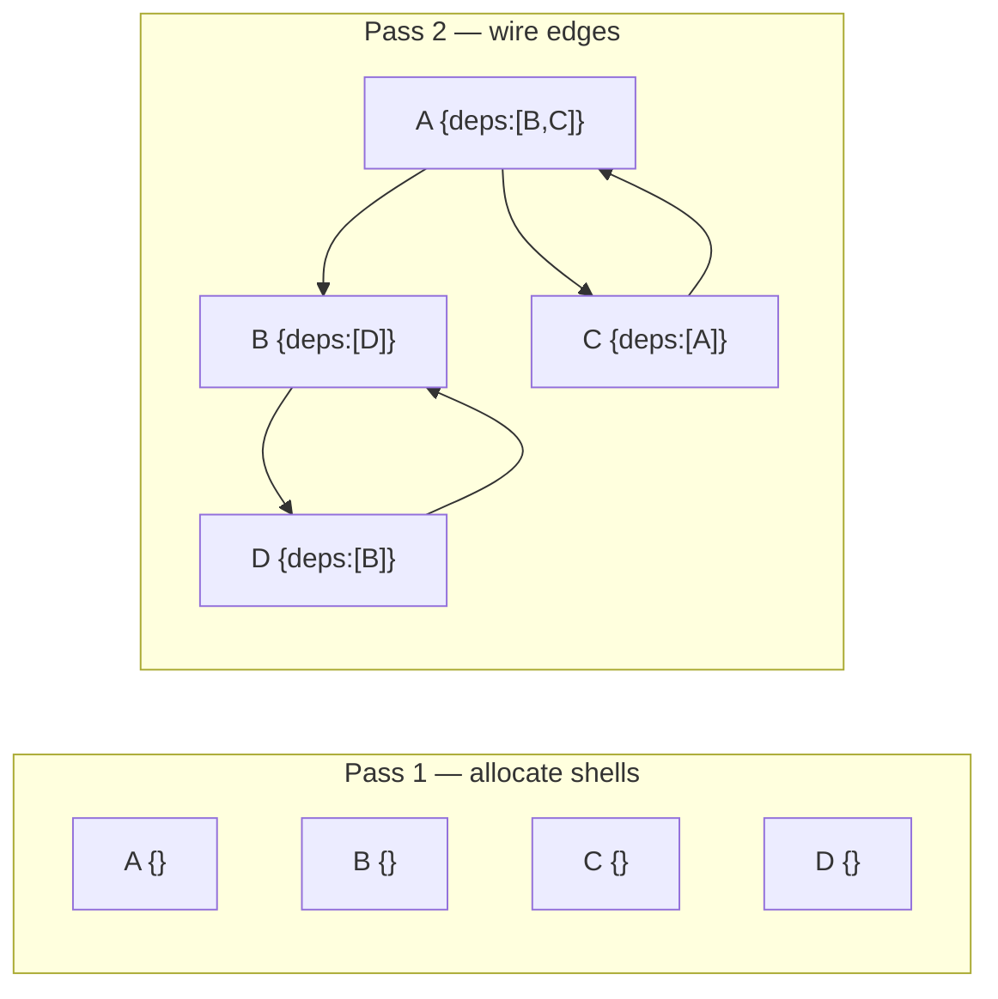

# Cycle-Safe Graph Population in O(V+E): A Two-Pass Solution

## §1 — Problem Definition: The Need for Deterministic Pointer-to-Object Replacement in Cyclic Graphs

The transformation of [[flat relational tuples]] into fully populated objects (sometimes referred to as hydration) is a fundamental bridging step between persistence layers and application logic. While this process is straightforward for Directed Acyclic Graphs (DAGs) using simple recursive descent, the algorithm gets more complex when applied to real-world schemas containing bidirectional or self-referential dependencies.
In the presence of cycles, naive recursive hydration has no safe termination guarantee. Because the traversal follows dependency edges without tracking which nodes it has already wired, cyclic references cause unbounded recursion and call stack overflow. Current industry workarounds typically rely on depth-limited heuristics (e.g., `maxDepth` guards). However, this is fundamentally flawed; the traversal terminates, but
the result is silently truncated, possibly producing an incomplete object graph.

This research proposes a Two-Pass algorithm. By decoupling memory allocation (Pass 1: Vertex Creation) from reference assignment (Pass 2: Edge Wiring), we achieve a cycle-safe solution that operates in $O(V+E)$ time. This approach replaces recursive uncertainty with a deterministic object population algorithm, to be explained in more detail below.

---

## §2 — A Recognized Challenge in the Data Layer Ecosystem

The limitations of current hydration strategies are not localized to a single library but represent a pervasive challenge in the data-layer ecosystem. One example is found in the Mongoose ODM JS library supporting MongoDB [Issue #16074](https://github.com/Automattic/mongoose/issues/16074), which does not have built in support for automatic, schema-driven popluation of all referenced paths in the model. Looking at the broader ORM/ODM landscape, the same pattern of cyclic reference challenges appears consistently across other data libraries — visible in their open issue trackers and documentation:

| Library                 | Issue / Discussion                                                                                                                               | Documentation                                                                                                                                                                                                                                     | Failure Mode                                                                                                                                                                                                   |
| ----------------------- | ------------------------------------------------------------------------------------------------------------------------------------------------ | ------------------------------------------------------------------------------------------------------------------------------------------------------------------------------------------------------------------------------------------------- | -------------------------------------------------------------------------------------------------------------------------------------------------------------------------------------------------------------- |
| **Mongoose**            | [#16074](https://github.com/Automattic/mongoose/issues/16074) — schema-driven `populateAll()` with `maxDepth`; cites circular refs as motivation | [Population docs](https://mongoosejs.com/docs/populate.html) — no built-in recursive populate                                                                                                                                                     | No automatic cycle handling; manual depth management required                                                                                                                                                  |
| **Sequelize**           | —                                                                                                                                                | [Eager Loading — Including Everything](https://sequelize.org/docs/v6/advanced-association-concepts/eager-loading/#including-everything), [Constraints & Circularities](https://sequelize.org/docs/v6/other-topics/constraints-and-circularities/) | `{ include: { all: true, nested: true } }` does not support circular schemas; developers must manually prune cyclic paths from the include definition                                                          |
| **TypeORM**             | [#3663](https://github.com/typeorm/typeorm/issues/3663) — `eager: true` on recursive relation causes infinite loop                               | [Eager/Lazy Relations](https://typeorm.io/eager-and-lazy-relations), [Relations FAQ](https://typeorm.io/relations-faq)                                                                                                                            | Disallows `eager: true` on both sides of a bidirectional relationship; circular eager relations are unsupported                                                                                                |
| **Prisma**              | [#3725](https://github.com/prisma/prisma/issues/3725) — feature request: support recursive relationships in queries                              | [Self-relations](https://www.prisma.io/docs/orm/prisma-schema/data-model/relations/self-relations) — no built-in recursive include; each nesting level must be explicitly written out                                                             | No automatic full-depth include; each depth level requires explicit nesting                                                                                                                                    |
| **MikroORM**            | —                                                                                                                                                | [Populating relations](https://mikro-orm.io/docs/populating-relations) — `populate: ['*']` on circular entities produces an unserialisable cyclic graph; explicit populate hints required                                                         | Hydration via Identity Map + select-in strategy is cycle-safe, but downstream serialization (e.g., `JSON.stringify`) fails on the resulting cyclic graph                                                       |
| **SQLAlchemy** (Python) | —                                                                                                                                                | <a href="https://docs.sqlalchemy.org/en/20/orm/session_basics.html">Session Basics</a>, <a href="https://docs.sqlalchemy.org/en/21/orm/relationship_persistence.html">Relationship Persistence</a>                                                | Session identity map resolves hydration cycles; mutual FK inserts raise `CircularDependencyError` — requires `post_update=True` (a two-pass insert strategy)                                                   |
| **Hibernate** (Java)    | —                                                                                                                                                | <a href="https://docs.hibernate.org/orm/current/userguide/html_single/#fetching">Fetching strategies</a>                                                                                                                                          | Persistence Context (L1 cache) acts as identity map — hydration is cycle-safe; however, Jackson serialization of cyclic graphs causes `StackOverflowError` without `@JsonIdentityInfo` or `@JsonBackReference` |
| **EF Core** (.NET)      | —                                                                                                                                                | <a href="https://learn.microsoft.com/en-us/ef/core/querying/related-data/#related-data-and-serialization">Related Data &amp; Serialization</a>                                                                                                    | `ChangeTracker` identity map resolves hydration cycles; `System.Text.Json` throws on circular navigation properties without `ReferenceHandler.IgnoreCycles`                                                    |

These are ORM/ODM libraries operating at the data layer — the abstraction level where population
and eager-loading live. Larger frameworks like Node.js core, Angular, and React operate at
different levels of abstraction and may handle related graph problems internally in ways we have
not investigated here. This experiment focuses specifically on the ORM/ODM population problem,
where the challenge is well-documented and no general iterative solution is widely available.

> **Scope note — hydration vs. serialization.** Several mature frameworks (SQLAlchemy, Hibernate,
> EF Core) solve cyclic hydration via identity maps — architecturally the same principle as the
> two-pass allocate-then-wire strategy tested here. However, their applications still crash when
> the cyclic in-memory graph reaches a serializer (Jackson, `System.Text.Json`, native
> `JSON.stringify`) that lacks its own cycle guard. Hydration correctness and downstream consumer
> viability are architecturally distinct concerns. This experiment measures both as separate stages:
> **Stage 1 — Hydration** (does the algorithm produce a correct in-memory graph?) and **Stage 2 —
> Consumer Probes** (can a downstream consumer process that graph?). See §4 for the two-stage
> results and [Ecosystem Research](./ECOSYSTEM_RESEARCH.md) §3 for extended analysis of the
> serialization boundary.

---

## §3 — The Four Algorithms

### Naive Recursion — the control

Recurse into each dependency. No cycle guard — no memoization. On any cyclic graph — even a
trivial 10-node one — the traversal re-enters a visited node and the call stack overflows.

On an acyclic graph with shared references (the `acyclic-control` tier), the algorithm fails
for a different reason: without memoization, each `populate()` call creates a fresh object, so
a node that appears as a dependency of multiple parents is represented by multiple distinct
objects rather than one shared instance. The comparers detect this identity mismatch and report
a hydration failure. The failure mode differs from the cyclic case, but the outcome is the
same: Naive Recursion fails on every dataset in this experiment.

### Map Tracker — correctness fix, not a scalability fix

Add a `visited` Map: if a node is already in the Map, return the cached result instead of
recursing. This eliminates infinite recursion but does not limit call stack depth. On a
50K-node graph, a single DFS path through unvisited nodes can push tens of thousands of frames
before any cycle is hit. The V8 stack limit is ~10K frames — the algorithm still crashes.

### Tarjan SCC Layering — iterative and correct

First, find every group of nodes that are mutually reachable from each other — these groups
are called Strongly Connected Components (SCCs). For example, if A → B → A, those two nodes
form one SCC. Next, collapse each SCC into a single "super-node" so the graph becomes a DAG
with no cycles. Finally, process that simplified DAG in layer order (topological sort), wiring
all dependencies at each layer before moving to the next. Every step uses an explicit stack or
queue — no recursion at all. Correct at any scale, but requires several auxiliary data
structures to track group membership and the collapsed graph.

### Two-Pass Wire — the winner

**Pass 1** — allocate every node shell into a Map:

```typescript
for (const comp of flatDatabaseState) {
  visited.set(comp.id, { id: comp.id, dependencies: [] });
}
```

**Pass 2** — wire dependency edges via Map lookup:

```typescript
for (const comp of flatDatabaseState) {
  const node = visited.get(comp.id)!;
  for (const depId of comp.dependencies) {
    node.dependencies.push(visited.get(depId)!);
  }
}
```

Cycles resolve automatically: if A depends on B and B depends on A, both JS objects already
exist in the Map, so each side's `.push()` captures a reference to the same object — no cycle
detection required. This is structurally identical to forward-declaration in compiled languages.

By separating allocation from wiring, the algorithm guarantees deterministic termination — no
risk of unbounded stack growth — and zero truncation — no silent `maxDepth` guards that produce
incomplete results.



---

## §4 — Results

> **Historical benchmark reference:** the numbers in §4 and §5 are from a CI run on ubuntu-latest
> with Node 22 and a 4 GB heap. Absolute timings and memory figures vary by hardware, Node
> version, and system load — treat them as order-of-magnitude indicators, not canonical benchmarks.
> 250K graph: 250,000 nodes, 500,181 edges. All passing results double-verified (smartCompare + flatCompare).

### Two-Stage Experiment Paradigm

The experiment runner measures each algorithm across two distinct stages:

1. **Stage 1 — Hydration**: did the algorithm produce a correct in-memory graph?  
   Verified by two independent comparers: `smartCompare` (cycle-aware iterative DFS) and
   `flatCompare` (index-based flat comparison against the raw answer file).  A result is
   *double-verified* only when both comparers agree.

2. **Stage 2 — Consumer Probes**: can a downstream consumer process the hydrated graph?  
   Runs only when hydration passes.  The experiment tests two consumer probes
   (see `src/utils/consumer.ts`):
   - **`naive-json`** — attempts `JSON.stringify` on the raw graph.  On an acyclic graph (the
     `acyclic-control` tier), this succeeds — there are no circular references to trip up the
     serializer.  On any cyclic graph, it fails with a circular reference error.  Its purpose
     is to demonstrate that hydration success ≠ consumer viability — the same failure mode
     documented for MikroORM, Hibernate, and EF Core in §2.
   - **`cycle-flat`** — converts the graph to an index-based flat representation (the
     `AnswerEntry` format) using an iterative O(V+E) traversal with no recursion.  This models
     the ID-Substitution / Custom Cycle-Aware Serialization strategies from
     [Ecosystem Research §3.3](./ECOSYSTEM_RESEARCH.md) and succeeds at any graph scale.

Consumer probes are modeled as a *downstream consumer* concern, not an algorithm correctness
criterion.  A `naive-json` failure does not mean the algorithm is wrong — it means a naive
downstream consumer would crash on the correctly hydrated result.

**Output scope:** The runner shows full-detail output (all three phase lines: Hydration →
Consumer probes → Full Run) for the `acyclic-control` and `basic` tiers.  `acyclic-control`
establishes the acyclic-graph baseline (where `naive-json` succeeds); `basic` establishes the
cyclic baseline (where `naive-json` fails and `cycle-flat` is the authoritative passing probe).
Later tiers suppress repeated consumer-probe detail because the probe outcomes are already
established by these two tiers.

### Scale Survivability — Stage 1 (Hydration)

The primary result is which algorithms survive at each tier. Two of four crash at production
scale.

| Algorithm       | acyclic-control (10)    | basic (10)        | medium (5K)       | stress (50K)      | extreme (250K)    |
| --------------- | ----------------------- | ----------------- | ----------------- | ----------------- | ----------------- |
| Naive Recursion | ❌ Identity mismatch    | ❌ Stack overflow | ❌ Stack overflow | ❌ Stack overflow | ❌ Stack overflow |
| Map Tracker     | ✅ Pass                 | ✅ Pass           | ✅ Pass           | ❌ Stack overflow | ❌ Stack overflow |
| Tarjan SCC      | ✅ Pass                 | ✅ Pass           | ✅ Pass           | ✅ Pass           | ✅ Pass           |
| Two-Pass Wire   | ✅ Pass                 | ✅ Pass           | ✅ Pass           | ✅ Pass           | ✅ Pass           |

Naive Recursion fails on `acyclic-control` for a different reason than on cyclic datasets:
without memoization, shared-reference nodes are duplicated into separate objects instead of
being wired to the same instance (identity mismatch, not stack overflow). Map Tracker is
especially deceptive: it passes at small scale (10–5K nodes), giving false confidence, then
crashes at production scale (50K+). The call stack depth, not the cycle guard, is the binding
constraint.

### Consumer Probe Viability — Stage 2

Stage 2 runs only for tiers where hydration passed.  The key insight is that even a correctly
hydrated cyclic graph can crash a naive downstream consumer — the hydration layer did its job,
but the response layer did not.

Consumer probe outcomes depend on whether the graph contains cycles, not on how many nodes it
has.  The runner shows full consumer-probe detail for `acyclic-control` and `basic`; later tiers
suppress repeated probe detail because the pattern is already established by those two tiers.

**acyclic-control (10-node DAG — no cycles):**

| Algorithm     | naive-json | cycle-flat |
| ------------- | ---------- | ---------- |
| Map Tracker   | ✅ Pass                     | ✅ Pass (output verified) |
| Tarjan SCC    | ✅ Pass                     | ✅ Pass (output verified) |
| Two-Pass Wire | ✅ Pass                     | ✅ Pass (output verified) |

On an acyclic graph, `JSON.stringify` succeeds — there are no circular references.  This
establishes the acyclic-graph baseline and confirms that `naive-json` failures on cyclic tiers
are caused by cycles, not by the algorithm.

**Cyclic datasets (basic and beyond — where hydration ✅):**

| Algorithm     | Tier where hydration ✅ | naive-json | cycle-flat |
| ------------- | ----------------------- | ---------- | ---------- |
| Map Tracker   | basic, medium (fails stress+) | ❌ Circular reference error | ✅ Pass (output verified) |
| Tarjan SCC    | all tiers               | ❌ Circular reference error | ✅ Pass (output verified) |
| Two-Pass Wire | all tiers               | ❌ Circular reference error | ✅ Pass (output verified) |

The `naive-json` column is uniformly ❌ on cyclic datasets because `JSON.stringify` has no
cycle guard.  This is the exact failure mode described for MikroORM (`populate: ['*']` produces
a cyclic graph that crashes `JSON.stringify`), Hibernate (requires `@JsonIdentityInfo`), and
EF Core (requires `ReferenceHandler.IgnoreCycles`).

The authoritative `cycle-flat` column is uniformly ✅, confirming that the iterative
index-based export strategy is safe at every graph scale — and that the verification pipeline
itself (which uses the same format) is consumer-safe by construction.

### O(V+E) complexity: analytical proof

Both passing algorithms are O(V+E) by construction — this can be verified directly in the source code:

**Two-Pass Wire** (`src/algorithms/schema-driven/01-two-pass-wire.ts`):

- Pass 1: one loop over all V nodes to allocate shells → O(V)
- Pass 2: one loop over all V nodes, and for each node iterates over its outgoing edges — each of the E edges is visited exactly once → O(V+E)
- Total: **O(V+E)**

**Formal notation:**

The allocation phase constructs an Identity Map M over the vertex set V:

```
M = { identity(v) : shell(v) | v ∈ V }    — O(V)
```

The wiring phase resolves every edge e = (u, v) ∈ E by a constant-time lookup in M:

```
∀ e = (u, v) ∈ E : wire(M[identity(u)], M[identity(v)])    — O(E)
```

Total: O(V) + O(E) = **O(V + E)**

**Tarjan SCC Layering** (`src/algorithms/topological/01-tarjan-scc-layering.ts`):

- Iterative Tarjan's SCC: each node and edge visited exactly once → O(V+E)
- Condensation DAG construction: one pass over all V nodes and E edges → O(V+E)
- Kahn's BFS layer assignment: one pass over condensed nodes and edges → O(V+E)
- Pre-allocation and wiring: O(V) + O(V+E)
- Total: **O(V+E)**

### Graph-scale confirmation

This subsection answers two questions: did the graph generator actually produce the expected
graph size at each tier, and did the algorithms produce the complete output? The `smartCompare`
verifier records how many nodes (`nodesProcessed`) and edges (`edgesTraversed`) it visits when
walking the produced output graph. These counts directly measure the output size:

| Tier           | Nodes   | Edges   | Total ops   | Scale ratio                   |
| -------------- | ------- | ------- | ----------- | ----------------------------- |
| stress (50K)   | 50,000  | 99,981  | **149,981** | —                             |
| extreme (250K) | 250,000 | 500,181 | **750,181** | 750,181 / 149,981 ≈ **5.00×** |

The 5.00× scale ratio matches the 5× node-count increase exactly, confirming both that the
graph generator produces consistent edge density across tiers, and that both algorithms output
the complete, correct graph at every scale — not a truncated or partial result.

### Time and memory (historical CI reference)

The figures below are from the historical CI run described in the note at the start of §4
(ubuntu-latest, Node 22, 4 GB heap). Absolute numbers vary materially by hardware, Node
version, and system load — observed values on other systems have differed by 2–4× even at the
same graph scale. The relative ordering (Two-Pass Wire consistently faster and lighter than
Tarjan SCC) is stable across environments.

| Algorithm     | basic (10)      | medium (5K)    | stress (50K)     | extreme (250K)    |
| ------------- | --------------- | -------------- | ---------------- | ----------------- |
| Map Tracker   | 0.3 ms / 0.0 MB | 13 ms / 3.0 MB | ❌               | ❌                |
| Tarjan SCC    | 0.8 ms / 0.1 MB | 46 ms / 9.2 MB | 277 ms / 14.8 MB | 2,360 ms / 149 MB |
| Two-Pass Wire | 0.2 ms / 0.0 MB | 13 ms / 2.9 MB | 67 ms / 7.4 MB   | 502 ms / 54 MB    |

> Times are wall-clock (ms); RAM is heap-delta (MB). Naive Recursion omitted — fails all tiers.

Both passing algorithms are fast enough for production use. The headline insight is not
performance — it is correctness under scale: two of the four approaches fail entirely at
production-scale graphs, including Map Tracker, which passes at small scale and gives false
confidence before crashing.

---

## §5 — Scaling Analysis

Both algorithms are O(V+E). The super-linear constant at 250K is V8 GC pressure on a large
live heap, not algorithmic complexity.  The ratios below are computed from the historical CI
reference figures in §4; actual observed ratios vary by environment.

| Metric                | Two-Pass Wire                      | Tarjan SCC              |
| --------------------- | ---------------------------------- | ----------------------- |
| 50K → 250K time ratio | ~7.5× (for 5× nodes, CI reference) | ~8.5× (CI reference)    |
| 50K → 250K RAM ratio  | ~7.3×                              | ~10.1×                  |
| Head-to-head at 250K  | **substantially faster / lighter** | —                       |
| Speed advantage       | **~4–5× faster** (environment-dependent) | —                  |
| RAM advantage         | **~2–3× less** (environment-dependent)   | —                  |

Tarjan's auxiliary structures (per-node index/lowlink, SCC sets, condensation DAG) add a
constant overhead per node that compounds with GC at large heap sizes. Two-Pass Wire
allocates exactly V+1 objects (the Map plus one shell per node) and nothing else.

---

## §6 — Dataset Scope and Input Validity

The benchmark targets a **root-reachable, single-root** object graph — the exact closure
materialized from one NodeJS/NoSQL request. Every node in a valid dataset is reachable from
the designated root by following dependency edges.

Additional constraints settled for the core benchmark:

- **Explicit declared root.** The root is provided in the dataset manifest; it is not inferred
  from graph structure (e.g. in-degree). A missing or ambiguous root is a preflight error.
- **Simple directed graph.** The benchmark assumes at most one directed edge between any
  ordered pair of nodes. Manifests with duplicate (parallel) edges are rejected at preflight;
  multigraph-style input is out of scope (see Ecosystem Research §6.3).
- **Validation is preflight.** All input admissibility checks run before any timed execution
  and have no effect on measured algorithm complexity, latency, or memory.

A full input-validity taxonomy — defining which graph shapes belong in the core benchmark,
which are edge-case-only structures, and which are invalid inputs (including orphaned nodes,
duplicate edges, and dangling references) — is defined in
[Ecosystem Research §6](./ECOSYSTEM_RESEARCH.md#6--dataset-scope-and-input-validity).
